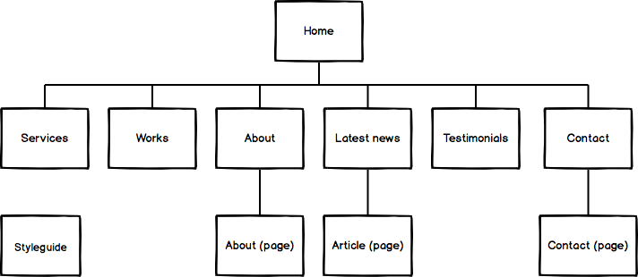

# 0x00. Advanced HTML

## Welcome!

Welcome to the Web Stack specialization. The 3 first projects will give you all basics of the Web development: HTML, CSS and Developer tools.

In this project, you will learn how to use HTML tags to structure a web page. No CSS, no styling - don’t worry, the final page will be “ugly” it’s normal, it’s not the purpose of this project.

Important note: <b>details are important</b>! lowercase vs uppercase / wrong letter… be careful!

## Resources
<b>Read or watch:</b>

<li>
    <a href ="https://intranet.alxswe.com/rltoken/3ZeSykXeV9rQhzFiW5GHcg">
        HTML 5.2
    </a>
</li>
<li>
    <a href ="https://intranet.alxswe.com/rltoken/XWdv6hMca_9jks7PN2gsbA">
        HTML: HyperText Markup Language | MDN
    </a>
</li>
<li>
    <a href ="https://intranet.alxswe.com/rltoken/H59e408ohxV9x_tYOWSxvg">
        HTML Reference - A free guide to all HTML elements and attributes
    </a>
</li>
<li>
    <a href ="https://intranet.alxswe.com/rltoken/u6RvQ_45Xpw82Awl82NZcg">
        Can I use… Support tables for HTML5, CSS3, etc
    </a>
</li>
<li>
    <a href ="https://intranet.alxswe.com/rltoken/6SV9Z98vlb8iehxHnl9YJg">
        HTML Cheat Sheet - WebsiteSetup
    </a>
</li>

## Learning Objectives
At the end of this project, you are expected to be able to explain to anyone, without the help of Google:

<li>Which guidelines to follow for HTML</li>
<li>How to create the skeleton of an HTML5 page</li>
<li>How to use semantic HTML tags to structure a web page</li>
<li>Which use cases to use div vs span</li>
<li>The semantic value’s of header, main, footer, article, nav, section, aside</li>
<li>How to use headings (and why it’s important to follow the hierarchical order)</li>
<li>How to make lists in HTML</li>
<li>The differences between medias (SVG, GIF, PNG, JPG)</li>
<li>How to structure data in a table</li>
<li>How to integrate a video in a webpage</li>
<li>How to integrate an audio file in a webpage</li>
<li>How to embed external content</li>
<li></li>
<li>How to correctly structure an HTML page</li>

## Requirements

<ul>
    <li>A README.md file at the root of the folder of the project is mandatory</li>
    <li>Your code should be W3C compliant and validate with W3C-Validator</li>
    <li>Techium will be the name of the company we will use across our webpages.</li>
</ul>

## Project Sitemap

## Wireframe of Techium project

