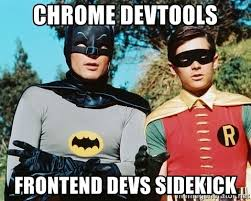

# 0x01. Developer tools

In this project, you will analyse this website <a href="https://dev-tools.alx-tools.com/">https://dev-tools.alx-tools.com/</a>

## Resources
<b>Read or watch:</b>

<li>
    <a href ="https://intranet.alxswe.com/rltoken/a00xWFVG2r6G3lphxOFexA">
        Chrome DevTools | Tools for Web Developers | Google Developers
    </a>
</li>
<li>
    <a href ="https://intranet.alxswe.com/rltoken/NMYYMG44e0dZ2eb5uR4iUQ">
        Introduction | Down and Dirty with Chrome Developer Tools
    </a>
</li>
<li>
    <a href ="https://intranet.alxswe.com/rltoken/If7a66qWg4qxhKuNPRoJCw">
        Firefox Developer Tools | MDN
    </a>
</li>
<li>
    <a href ="https://intranet.alxswe.com/rltoken/rdGj_NA-X--rwekzt9bffQ">
        Dev Tips - Developer Tips by Umar Hansa
    </a>
</li>
<li>
    <a href ="https://intranet.alxswe.com/rltoken/rU_42ND20tHzosN2V1xP1w">
       Get Started With Viewing And Changing CSS | Tools for Web Developers
    </a>
</li>
<li>
    <a href ="https://intranet.alxswe.com/rltoken/UiqZ7pmI5L7BMr3ZaG4Bow">
        Keeping it simple with the JavaScript console - LogRocket Blog
    </a>
</li>
<li>
    <a href ="https://intranet.alxswe.com/rltoken/I_IHgn0hsaB1kee6RgU1SQ">
        Inspect Network Activity - Chrome DevTools 101
    </a>
</li>

## Learning Objectives
At the end of this project, you are expected to be able to explain to anyone, without the help of Google:

<li>What Developer Tools in your browser are</li>
<li>How to open the Developer Tools on Chrome, Firefox, Safari, and Edge.</li>
<li>How to use the elements tab to edit HTML and CSS</li>
<li>How to audit a page according to the tips suggested by Lighthouse</li>
<li>How to create and run snippets on a page</li>
<li>How to get information about files and server configurations</li>
<li>How to block requests</li>
<li>How to know how much JavaScript or CSS is used on a page</li>
<li>How to detect 404 issues</li>
<li>How to move elements on a webpage</li>

## Requirements
### General
<ul>
    <li>A README.md file at the root of the folder of the project is mandatory</li>
    <li>Use the newest version of Google Chrome browser (78.0.3904.70 or later).</li>
    <li>Screenshots can be taken via the OS, not necessary via the DevTools. These screenshots are used to see how and where you are doing/playing with the DevTools.</li>
</ul>

